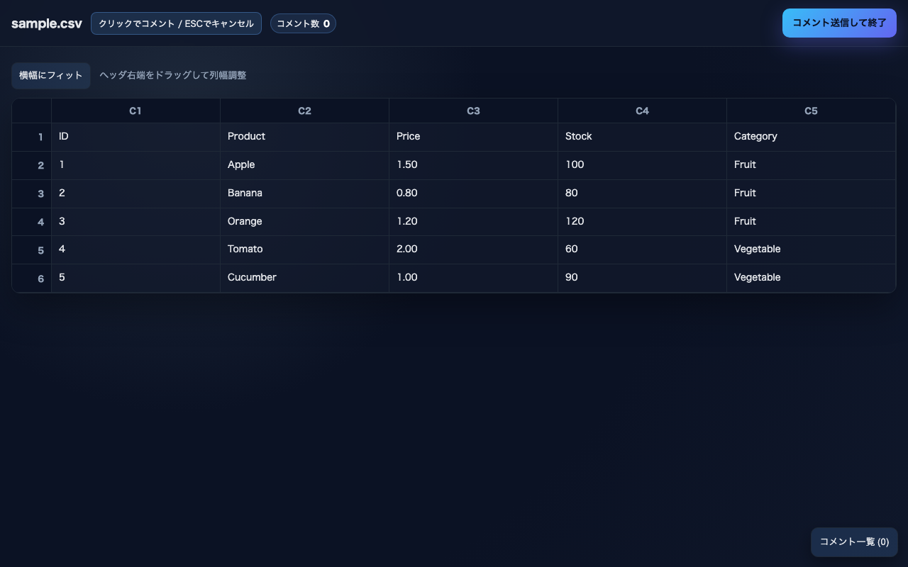

# annotab

A lightweight browser-based tool for reviewing and annotating tabular data, text, and Markdown files. Supports CSV, TSV, plain text, and Markdown. Comments are output as YAML to stdout.

## Features

- **CSV/TSV support**: View tabular data with column/row freezing and filtering
- **Markdown support**: Side-by-side preview and source view for easy annotation
- **Text support**: Line-by-line commenting for plain text files
- **Real-time**: Hot reload on file changes via SSE
- **YAML output**: Comments exported with file, mode, row, col, value, and text

## Installation

```bash
npm install -g annotab
```

Or run directly with npx:

```bash
npx annotab <file>
```

## Usage

```bash
annotab <file> [--port 3000] [--encoding utf8|shift_jis|...]
```

- Browser opens automatically (macOS: `open` / Linux: `xdg-open` / Windows: `start`)
- Click cells to add comments
- Close the tab or click "Submit & Exit" to output comments as YAML and terminate the server
- Encoding defaults to UTF-8; use `--encoding` to specify or let `chardet` auto-detect (Shift_JIS, CP932, etc.)

## Screenshots

### CSV View



### Markdown View


## Output Example

```yaml
file: data.csv
mode: csv
reason: button
at: '2025-11-26T12:00:00.000Z'
comments:
  - row: 2
    col: 3
    text: This value needs review
    value: '150'
```

## Development

- Main source: `cli.cjs`
- Tests: `npm test` (vitest + playwright)

## License

MIT
