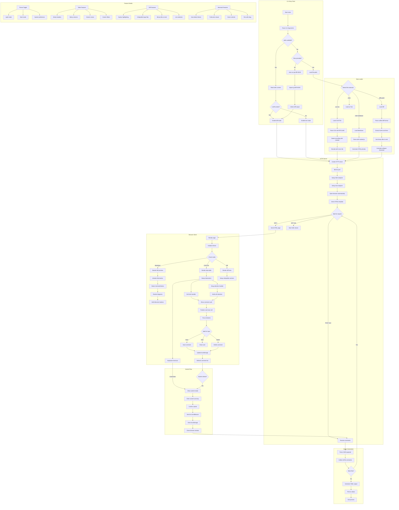
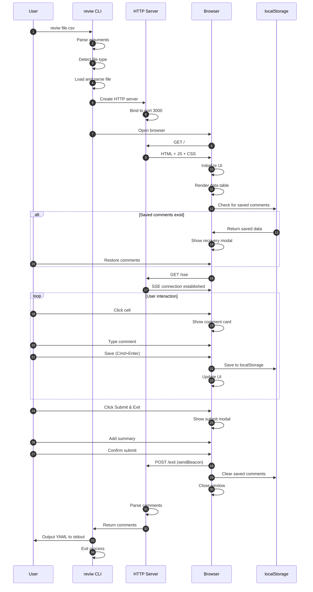
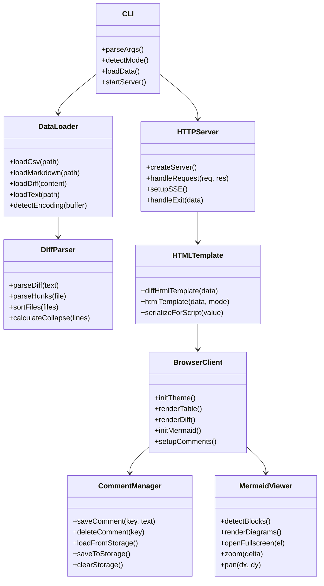
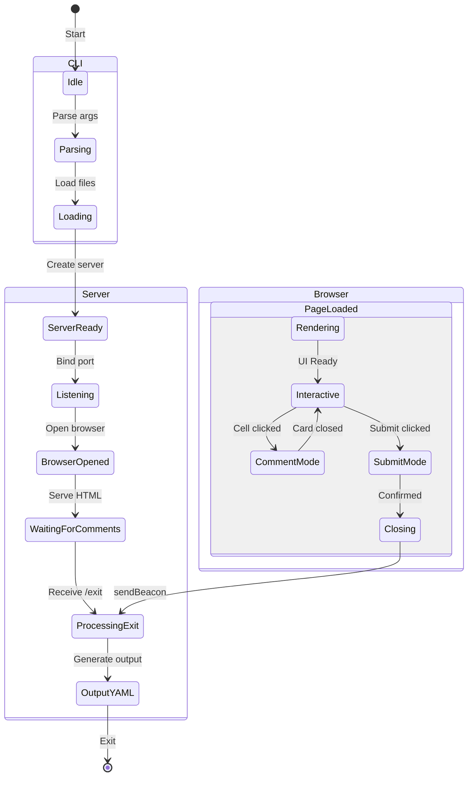

# Reviw CLI Workflow

## Complete System Architecture

```mermaid
flowchart TB
    subgraph CLI["CLI Entry Point"]
        START[Start reviw] --> PARSE_ARGS[Parse CLI Arguments]
        PARSE_ARGS --> CHECK_STDIN{stdin available?}
        CHECK_STDIN -->|Yes| READ_STDIN[Read stdin content]
        CHECK_STDIN -->|No| CHECK_FILES{Files provided?}
        CHECK_FILES -->|No| AUTO_DIFF[Auto run git diff HEAD]
        CHECK_FILES -->|Yes| LOAD_FILES[Load file paths]
        READ_STDIN --> DETECT_DIFF{Is diff content?}
        DETECT_DIFF -->|Yes| DIFF_MODE[Enable diff mode]
        DETECT_DIFF -->|No| TEXT_MODE[Enable text mode]
        AUTO_DIFF --> SPAWN_GIT[Spawn git diff HEAD]
        SPAWN_GIT --> COLLECT_DIFF[Collect diff output]
        COLLECT_DIFF --> DIFF_MODE
    end

    subgraph LOADER["Data Loader"]
        LOAD_FILES --> DETECT_EXT{Detect file extension}
        DETECT_EXT -->|.csv/.tsv| LOAD_CSV[Load CSV/TSV]
        DETECT_EXT -->|.md/.markdown| LOAD_MD[Load Markdown]
        DETECT_EXT -->|.diff/.patch| LOAD_DIFF[Load Diff]
        DETECT_EXT -->|other| LOAD_TEXT[Load as Text]

        LOAD_CSV --> PARSE_CSV[Parse CSV with RFC4180]
        PARSE_CSV --> DETECT_ENCODING[Detect encoding with chardet]
        DETECT_ENCODING --> DECODE_CONTENT[Decode with iconv-lite]

        LOAD_MD --> PARSE_MD[Parse with marked.js]
        PARSE_MD --> GENERATE_PREVIEW[Generate HTML preview]

        LOAD_DIFF --> PARSE_UNIFIED[Parse unified diff format]
        PARSE_UNIFIED --> EXTRACT_HUNKS[Extract hunks and lines]
        EXTRACT_HUNKS --> SORT_BINARY[Sort binary files to end]
        SORT_BINARY --> CALC_COLLAPSE[Calculate collapse threshold]
    end

    subgraph SERVER["HTTP Server"]
        DIFF_MODE --> CREATE_SERVER[Create HTTP server]
        TEXT_MODE --> CREATE_SERVER
        DECODE_CONTENT --> CREATE_SERVER
        GENERATE_PREVIEW --> CREATE_SERVER
        CALC_COLLAPSE --> CREATE_SERVER

        CREATE_SERVER --> BIND_PORT[Bind to port]
        BIND_PORT --> SETUP_SSE[Setup SSE endpoint]
        SETUP_SSE --> SETUP_EXIT[Setup /exit endpoint]
        SETUP_EXIT --> OPEN_BROWSER[Open browser automatically]

        OPEN_BROWSER --> SERVE_HTML[Serve HTML template]
        SERVE_HTML --> WAIT_REQUEST{Wait for request}
        WAIT_REQUEST -->|GET /| SEND_HTML[Send HTML page]
        WAIT_REQUEST -->|GET /sse| START_SSE[Start SSE stream]
        WAIT_REQUEST -->|POST /exit| RECEIVE_COMMENTS[Receive comments]
    end

    subgraph BROWSER["Browser Client"]
        SEND_HTML --> RENDER_PAGE[Render page]
        RENDER_PAGE --> INIT_THEME[Initialize theme]
        INIT_THEME --> CHECK_MODE{Check mode}

        CHECK_MODE -->|CSV/TSV| RENDER_TABLE[Render data table]
        CHECK_MODE -->|Markdown| RENDER_MD_PREVIEW[Render MD preview]
        CHECK_MODE -->|Diff| RENDER_DIFF[Render diff view]

        RENDER_TABLE --> SETUP_INTERACTIONS[Setup interactions]
        RENDER_MD_PREVIEW --> INIT_MERMAID[Initialize Mermaid.js]
        RENDER_DIFF --> SETUP_COLLAPSE[Setup collapsible sections]

        INIT_MERMAID --> DETECT_MERMAID[Detect mermaid blocks]
        DETECT_MERMAID --> RENDER_DIAGRAMS[Render diagrams]
        RENDER_DIAGRAMS --> ADD_FULLSCREEN[Add fullscreen buttons]

        SETUP_INTERACTIONS --> CELL_CLICK[Cell click handler]
        SETUP_INTERACTIONS --> DRAG_SELECT[Drag selection handler]
        SETUP_INTERACTIONS --> KEYBOARD[Keyboard shortcuts]

        CELL_CLICK --> SHOW_COMMENT_CARD[Show comment card]
        DRAG_SELECT --> MULTI_SELECT[Multi-cell selection]
        MULTI_SELECT --> SHOW_COMMENT_CARD

        SHOW_COMMENT_CARD --> POSITION_CARD[Position card near cell]
        POSITION_CARD --> FOCUS_INPUT[Focus textarea]
        FOCUS_INPUT --> WAIT_INPUT{Wait for input}

        WAIT_INPUT -->|Save| SAVE_COMMENT[Save comment]
        WAIT_INPUT -->|Delete| DELETE_COMMENT[Delete comment]
        WAIT_INPUT -->|ESC| CLOSE_CARD[Close card]

        SAVE_COMMENT --> UPDATE_STORAGE[Update localStorage]
        UPDATE_STORAGE --> REFRESH_LIST[Refresh comment list]
        DELETE_COMMENT --> UPDATE_STORAGE
    end

    subgraph SUBMIT["Submit Flow"]
        KEYBOARD -->|Cmd+Enter| SUBMIT_MODAL[Show submit modal]
        REFRESH_LIST --> CHECK_SUBMIT{Submit clicked?}
        CHECK_SUBMIT -->|Yes| SUBMIT_MODAL

        SUBMIT_MODAL --> ENTER_SUMMARY[Enter overall summary]
        ENTER_SUMMARY --> CONFIRM_SUBMIT[Confirm submit]
        CONFIRM_SUBMIT --> SEND_BEACON[Send via sendBeacon]
        SEND_BEACON --> CLEAR_STORAGE[Clear localStorage]
        CLEAR_STORAGE --> CLOSE_WINDOW[Close browser window]
    end

    subgraph OUTPUT["Output Generation"]
        RECEIVE_COMMENTS --> PARSE_JSON[Parse JSON payload]
        PARSE_JSON --> COLLECT_ALL[Collect all file comments]
        COLLECT_ALL --> CHECK_REMAINING{More files?}
        CHECK_REMAINING -->|Yes| WAIT_REQUEST
        CHECK_REMAINING -->|No| GENERATE_YAML[Generate YAML output]
        GENERATE_YAML --> STDOUT[Print to stdout]
        STDOUT --> EXIT[Exit process]
    end

    subgraph FEATURES["Feature Details"]
        direction TB
        F1[Theme Toggle] --> F1A[Light mode]
        F1 --> F1B[Dark mode]
        F1 --> F1C[System preference]

        F2[Table Features] --> F2A[Sticky headers]
        F2 --> F2B[Sticky columns]
        F2 --> F2C[Column resize]
        F2 --> F2D[Column filters]

        F3[Diff Features] --> F3A[Syntax highlighting]
        F3 --> F3B[Collapsible large files]
        F3 --> F3C[Binary files at end]
        F3 --> F3D[Line selection]

        F4[Mermaid Features] --> F4A[Auto-detect blocks]
        F4 --> F4B[Fullscreen viewer]
        F4 --> F4C[Zoom controls]
        F4 --> F4D[Pan with drag]
    end

    CLOSE_WINDOW --> RECEIVE_COMMENTS
```

## Data Flow Sequence

```mermaid
sequenceDiagram
    autonumber
    participant User
    participant CLI as reviw CLI
    participant Server as HTTP Server
    participant Browser
    participant Storage as localStorage

    User->>CLI: reviw file.csv
    CLI->>CLI: Parse arguments
    CLI->>CLI: Detect file type
    CLI->>CLI: Load and parse file
    CLI->>Server: Create HTTP server
    Server->>Server: Bind to port 3000
    CLI->>Browser: Open browser

    Browser->>Server: GET /
    Server->>Browser: HTML + JS + CSS
    Browser->>Browser: Initialize UI
    Browser->>Browser: Render data table
    Browser->>Storage: Check for saved comments

    alt Saved comments exist
        Storage->>Browser: Return saved data
        Browser->>Browser: Show recovery modal
        User->>Browser: Restore comments
    end

    Browser->>Server: GET /sse
    Server->>Browser: SSE connection established

    loop User interaction
        User->>Browser: Click cell
        Browser->>Browser: Show comment card
        User->>Browser: Type comment
        User->>Browser: Save (Cmd+Enter)
        Browser->>Storage: Save to localStorage
        Browser->>Browser: Update UI
    end

    User->>Browser: Click Submit & Exit
    Browser->>Browser: Show submit modal
    User->>Browser: Add summary
    User->>Browser: Confirm submit

    Browser->>Server: POST /exit (sendBeacon)
    Browser->>Storage: Clear saved comments
    Browser->>Browser: Close window

    Server->>Server: Parse comments
    Server->>CLI: Return comments
    CLI->>User: Output YAML to stdout
    CLI->>CLI: Exit process
```

## Module Dependencies

```mermaid
classDiagram
    class CLI {
        +parseArgs()
        +detectMode()
        +loadData()
        +startServer()
    }

    class DataLoader {
        +loadCsv(path)
        +loadMarkdown(path)
        +loadDiff(content)
        +loadText(path)
        +detectEncoding(buffer)
    }

    class DiffParser {
        +parseDiff(text)
        +parseHunks(file)
        +sortFiles(files)
        +calculateCollapse(lines)
    }

    class HTTPServer {
        +createServer()
        +handleRequest(req, res)
        +setupSSE()
        +handleExit(data)
    }

    class HTMLTemplate {
        +diffHtmlTemplate(data)
        +htmlTemplate(data, mode)
        +serializeForScript(value)
    }

    class BrowserClient {
        +initTheme()
        +renderTable()
        +renderDiff()
        +initMermaid()
        +setupComments()
    }

    class CommentManager {
        +saveComment(key, text)
        +deleteComment(key)
        +loadFromStorage()
        +saveToStorage()
        +clearStorage()
    }

    class MermaidViewer {
        +detectBlocks()
        +renderDiagrams()
        +openFullscreen(el)
        +zoom(delta)
        +pan(dx, dy)
    }

    CLI --> DataLoader
    CLI --> HTTPServer
    DataLoader --> DiffParser
    HTTPServer --> HTMLTemplate
    HTMLTemplate --> BrowserClient
    BrowserClient --> CommentManager
    BrowserClient --> MermaidViewer
```

## State Machine

```mermaid
stateDiagram-v2
    [*] --> Idle: Start

    state CLI {
        Idle --> Parsing: Parse args
        Parsing --> Loading: Load files
        Loading --> ServerReady: Create server
    }

    state Server {
        ServerReady --> Listening: Bind port
        Listening --> BrowserOpened: Open browser
        BrowserOpened --> WaitingForComments: Serve HTML
        WaitingForComments --> ProcessingExit: Receive /exit
        ProcessingExit --> OutputYAML: Generate output
    }

    state Browser {
        state PageLoaded {
            Rendering --> Interactive: UI Ready
            Interactive --> CommentMode: Cell clicked
            CommentMode --> Interactive: Card closed
            Interactive --> SubmitMode: Submit clicked
            SubmitMode --> Closing: Confirmed
        }
    }

    OutputYAML --> [*]: Exit
    Closing --> ProcessingExit: sendBeacon
```
